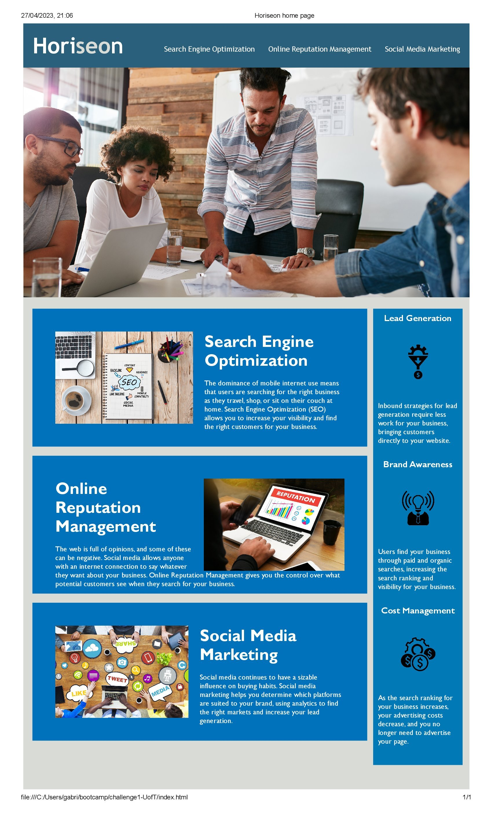

# Chanllenge #1 UofT Cooding Bootcamp
Welcome to my first work on a website! Here are some important details and instructions to help you navigate the website:

## Description
This website was created as a project for the UofT Coding Bootcamp. As part of the curriculum, we were tasked with learning HTML and CSS refactoring a website. This project has given me the opportunity to learn valuable skills and put them into practice in a real-world scenario. I am excited to continue improving my skills and creating more projects in the future.  

The goal was to create a codebase that follows accessibility standards
and to be optimized for search engines. 

So, I added <alt> attributes in every image and <title> in the background-image, adjusted contrast and changed the typography to meet the accessibility standards.  Also, I overwrite some elements to convert them into semantic HTML elements and get a better structure of the HTML. 

The images were resized to 50% to make the website faster. 

## Getting started
To access the website, simply type in the website address into your web browser. Once the website loads, you will be presented with the homepage. From there, you can navigate to different sections of the website using the menu bar at the top of the page.

A screenshot is available inside the assets folder.

## Credits

Thank you to UofT Coding Bootcamp Team for providing everything I need to build this Guide. A huge thank you to https://www.w3schools.com/; https://www.freecodecamp.org/; and https://developer.mozilla.org/en-US/. Those amazing website have been fundamental in this journey. 

Thank you, Gabriela Parada, who encouraged me to take this path and provided many resources to improve my coding skills. 

## License 

Please refer to the License in the repo.

---

## How to Contribute

You can contribute to this Guide through xxxxxxxxxxxxxxxxxxxxxxxxxxxxxxxxxxxxxxxxxxxxxxxxx

Thank you for visiting my website and supporting my learning journey. 
//
